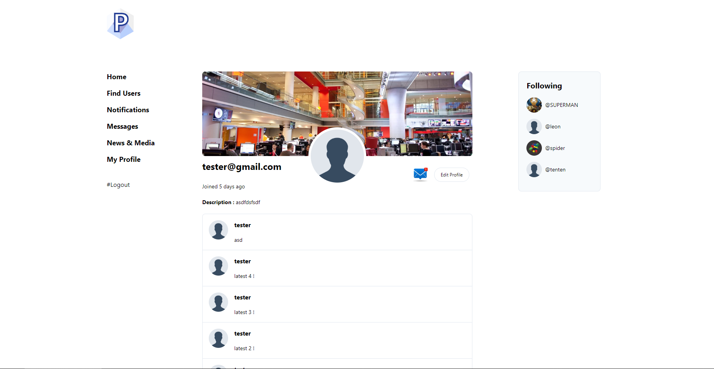
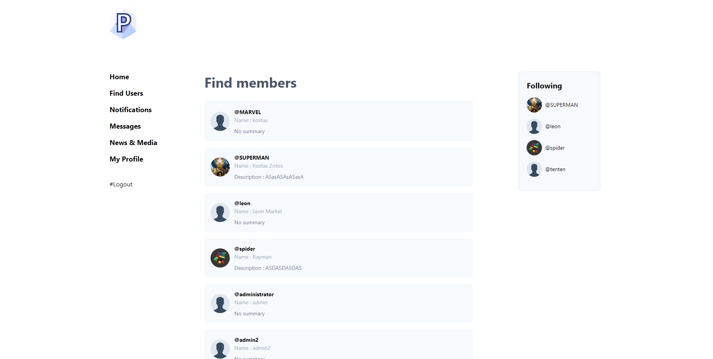

# docker-compose-laravel twitter clone
## Usage

To get started, make sure you have [Docker installed](https://docs.docker.com/docker-for-mac/install/) on your system, and then clone this repository.


- **nginx** - `:8080` (localhost)
- **mysql** - `:3306`
- **php** - `:9000`





## Create a new laravel project
- copy paste the folders of this repo isnide the src
- modify the ports and database credentials
- run the migrations

## Persistent MySQL Storage
Path example root (./postground/mysql )
````
SQL stored with a docker-container volume given the following parameters  ( ``` volumes:
      - ./mysql:/var/lib/mysql ``` )

 mysql:
    image: mysql:5.7.29
    container_name: mysql
    restart: unless-stopped
    tty: true
    ports:
      - "3306:3306"
    volumes:
      - ./mysql:/var/lib/mysql
    environment:
      MYSQL_DATABASE: twitter
      MYSQL_USER: admin
      MYSQL_PASSWORD: admin
      MYSQL_ROOT_PASSWORD: admin
      SERVICE_TAGS: dev
      SERVICE_NAME: mysql
    networks:
      - laravel
```
## You can modify the .env file to change ports


